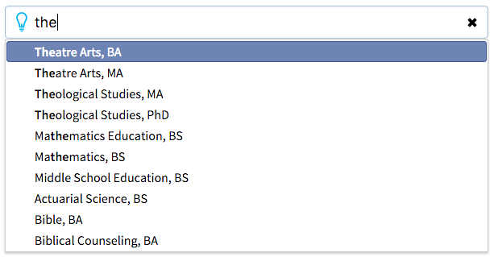

# programsearch

A simple script to demonstrate how rapid parsing of prefetched JSON data can dramatically improve user experience. As seen on bju.edu.

Search for a degree program using any keyword you can think of. The search script will parse through downloaded JSON data of all the programs offered at Bob Jones University. It will find and rank matches based on a number of criteria such as whether the program name starts with the search string, contains the search string, or has a concentration, tag, or keyword that matches.

When matches are returned, hover or use the arrow keys to select a match and click or press Enter to navigate to that program's page on the website.

If Google Analytics tracking code is properly set up, the script will track user actions by creating events for various things: what a user searched for, what the user clicked on, which search queries returned no results, etc.
